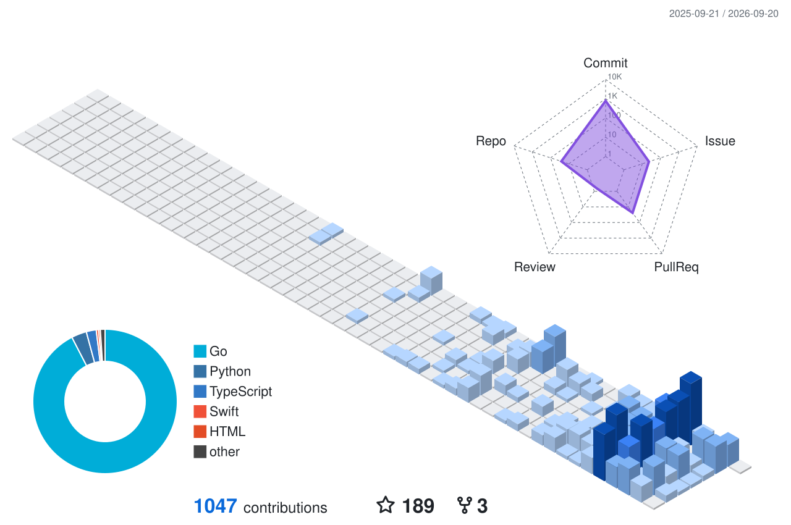

<!--
  rezzminator — profile README.
  The four big visuals are generated inside this repo by GitHub Actions with the default
  GITHUB_TOKEN and served as static SVGs, so no rented widget instance can 503 them.
  (The small badges are external: shields.io, skillicons.dev, komarev.)
    assets/hero-*.svg            scripts/hero.mjs — isometric contribution terrain on a
                                 liquid-glass backdrop, refracted through the pane. Hand-written SVG.
    assets/stats-*.svg           scripts/stats.mjs   -> .github/workflows/stats.yml
    profile-3d-contrib/*.svg     3d-contrib action   -> .github/workflows/3d.yml
    assets/snake-*.svg           Platane/snk         -> .github/workflows/snake.yml
  Theme-aware via <picture> + prefers-color-scheme. Edit content between the cards, not the cards.
-->

<div align="center">

<picture>
  <source media="(prefers-color-scheme: dark)" srcset="assets/hero-dark.svg">
  
</picture>

<br/>

I build the machinery behind LLM systems — LangChain/LangGraph pipelines, retrieval,<br/>
agent tooling, and the distributed services underneath them.

<a href="https://x.com/Rezzminator">
  </a>
<a href="https://stackoverflow.com/users/11651903/mamzi0100">
  </a>


</div>

---

### `~ $ whoami`

- 🧠  **LLM pipelines** — LangChain and LangGraph in Python: stateful multi-step graphs, structured output that actually validates, retrieval over messy real-world documents.
- 🤖  **Agent systems** — multi-agent research and QA pipelines on top of Claude Code, with schedulers, claim ledgers, and gates that refuse bad work.
- 🛠  **The infrastructure underneath** — Go and Rust for the hot paths, Postgres and vector stores for the memory, Docker and Kubernetes to hold it together.
- 🧪  **Curious to a fault** — a WebGL glass shader, an EU-AI-Act validator, a Brainfuck interpreter. If it's interesting, it gets built.
- 📫  Find me on [X](https://x.com/Rezzminator).

<br/>

### 🧰 Tech I reach for

<div align="center">


<br/><br/>

<picture>
  <source media="(prefers-color-scheme: dark)" srcset="https://skillicons.dev/icons?i=go%2Crust%2Cpython%2Cts%2Cjs%2Cswift%2Cdocker%2Ckubernetes%2Cpostgres%2Credis%2Ccassandra%2Cgraphql%2Caws%2Clinux%2Cnginx%2Cbash&perline=8&theme=dark">
  
</picture>
</div>

<br/>

### 📌 Featured work

<table>
<tr>
<td width="50%" valign="top">

#### 🎓 [professor](https://github.com/rezzminator/professor) · Go
A discipline layer for AI coding agents — multi-agent pipelines with schedulers, QA gates, and a `pfm` CLI that treats every running chat as infrastructure.
<br/><sub>`Go` · `Multi-agent` · `Pipelines`</sub>

</td>
<td width="50%" valign="top">

#### 🧩 [gemini-coax](https://github.com/rezzminator/gemini-coax) · Python
Makes Gemini structured output actually validate against your Pydantic models — repairs the `anyOf`/enum drop and ignored bounds that break LangChain chains.
<br/><sub>`LangChain` · `Pydantic` · `Vertex AI`</sub>

</td>
</tr>
<tr>
<td width="50%" valign="top">

#### 📊 [limit-dashboard](https://github.com/rezzminator/limit-dashboard) · Swift
Native macOS dashboard for AI subscription limits — Claude, Codex and Vertex usage in one live, local-only view.
<br/><sub>`Swift` · `SwiftUI` · `macOS`</sub>

</td>
<td width="50%" valign="top">

#### 🌾 [harvester-web-mcp](https://github.com/rezzminator/harvester-web-mcp) · Python
Retrieval front-end for LLM pipelines: web pages, PDFs, Office docs and archives to clean Markdown, with a wall-bypass ladder for walled academic sources.
<br/><sub>`Python` · `MCP` · `Ingestion`</sub>

</td>
</tr>
<tr>
<td width="50%" valign="top">

#### 📄 [resume101](https://github.com/rezzminator/resume101) · ⭐ 135
An opinionated resume guide for experienced software engineers. My most-starred project by a wide margin.
<br/><sub>`Guide` · `Career`</sub>

</td>
<td width="50%" valign="top">

#### 🌫 [liquid-glass](https://github.com/rezzminator/liquid-glass) · WebGL
Zero-dependency liquid-glass effect — smoke refracted through a bevelled glass slab, every parameter a live knob. [Live demo »](https://rezzminator.github.io/liquid-glass/)
<br/><sub>`WebGL` · `GLSL` · `Zero-deps`</sub>

</td>
</tr>
</table>

<br/>

<br/>

### 🛰 Right now: [professor](https://github.com/rezzminator/professor)

Most AI coding setups treat chats as scrollback. Professor treats them as **infrastructure** —
a discipline layer of agent pipelines and QA gates, plus `pfm`, a Go CLI that manages every AI
coding session running on your machine: Claude Code, Codex and OpenCode, across accounts.

```text
 pfm  🥇 account 1 · ⚡1h · 12 rows · 38 killed · 64 empty
 tabs   Chats   Stats   Limits    tab/shift+tab
 Chats · fuzzy search and all existing chat controls
find › type project or name                                                        12/12 visible
╭─ fleet 12 ───────────────────────────────────────────────────────────────────────────────────────╮
│╭─ api                                                                                            │
│› ✦ [ Claude ] Codex OpenCode     🥇                                             0p     0B      0s│
││ ● PAYMENTS_REFACTOR             ⬢ 🥇 ⇄                                       118p    14M      2m│
││ ⚙ SCHEMA_MIGRATION              ⚙ agent 🥈                                    20p   6.1M      7h│
│╭─ webapp                                                                                         │
││ ● ORCHESTRATOR                  🥇 ⇄ ←here                                    37p   2.7M      1m│
││ ⚙ DESIGN_PASS                   ⚙ agent 🥇                                    18p   1.9M     58m│
││ ↻ DEPLOY_PROD                   🥇                                            59p   8.6M      2d│
│╭─ ops                                                                                            │
││ ● FLEET_BUILDER                 ⬢ ⇄                                           77p    94M      0s│
││ ↻ CCC                           🥈                                           452p    32M     54m│
╰──────────────────────────────────────────────────────────────────────────────────────────────────╯
 ↑↓ move  enter open  esc cancel  type to fuzzy-find
 ⌃X hide  ⌃E 1h  ⌃S account  ⌃O reboot
```

> Every AI chat on the machine, grouped by repo — live (`●`), resumable (`↻`) or agent-run (`⚙`),
> across accounts (🥇🥈). `⇄` marks chats that talk to other chats; `←here` is the one you are
> sitting in. Pick one, attach, or fire it a goal without ever attaching.
> There is a **cosmos** tab too, which draws the same fleet as a star map.

### 📈 GitHub at a glance

<div align="center">
<picture>
  <source media="(prefers-color-scheme: dark)" srcset="assets/stats-dark.svg">
  
</picture>
</div>

<br/>

### 🧊 The same year, broken down

<div align="center">
<picture>
  <source media="(prefers-color-scheme: dark)" srcset="profile-3d-contrib/profile-3d-dark.svg">
  
</picture>
</div>

<br/>

### 🐍 ...and the snake that eats it

<div align="center">
<picture>
  <source media="(prefers-color-scheme: dark)" srcset="assets/snake-dark.svg">
  
</picture>
</div>

<br/>

<div align="center">
<sub>The banner, stats card, 3D graph and snake are generated in this repo by GitHub Actions and committed as static SVGs — the badges are the only rented pixels.</sub>
</div>
